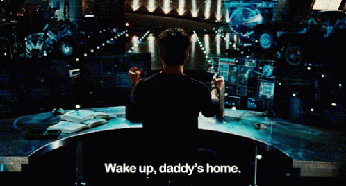

# Clap Clap Wake Up



```text
⠄⠄⠄⠄⠄⠄⠄⠄⠄⠄⠄⠄⠄⠄⠄⠄⠄⠄⠄⢀⢄⢄⠢⡠⡀⢀⠄⡀⡀⠄⠄⠄⠄⠐⠡⠄⠉⠻⣻⣟⣿⣿⣄⠄⠄⠄⠄⠄⠄⠄⠄
⠄⠄⠄⠄⠄⠄⠄⠄⠄⠄⠄⠄⠄⠄⠄⠄⠄⠄⢠⢣⠣⡎⡪⢂⠊⡜⣔⠰⡐⠠⠄⡾⠄⠈⠠⡁⡂⠄⠔⠸⣻⣿⣿⣯⢂⠄⠄⠄⠄⠄⠄
⠄⠄⠄⠄⠄⠄⠄⠄⡀⠄⠄⠄⠄⠄⠄⠄⠐⢰⡱⣝⢕⡇⡪⢂⢊⢪⢎⢗⠕⢕⢠⣻⠄⠄⠄⠂⠢⠌⡀⠄⠨⢚⢿⣿⣧⢄⠄⠄⠄⠄⠄
⠄⠄⠄⠄⠄⠄⠄⡐⡈⠌⠄⠄⠄⠄⠄⠄⠄⡧⣟⢼⣕⢝⢬⠨⡪⡚⡺⡸⡌⡆⠜⣾⠄⠄⠄⠁⡐⠠⣐⠨⠄⠁⠹⡹⡻⣷⡕⢄⠄⠄⠄
⠄⠄⠄⠄⠄⠄⢄⠇⠂⠄⠄⠄⠄⠄⠄⠄⢸⣻⣕⢗⠵⣍⣖⣕⡼⡼⣕⢭⢮⡆⠱⣽⡇⠄⠄⠂⠁⠄⢁⠢⡁⠄⠄⠐⠈⠺⢽⣳⣄⠄⠄
⠄⠄⠄⠄⠄⢔⢕⢌⠄⠄⠄⠄⠄⢀⠄⠄⣾⢯⢳⠹⠪⡺⡺⣚⢜⣽⣮⣳⡻⡇⡙⣜⡇⠄⠄⢸⠄⠄⠂⡀⢠⠂⠄⢶⠊⢉⡁⠨⡒⠄⠄
⠄⠄⠄⠄⡨⣪⣿⢰⠈⠄⠄⠄⡀⠄⠄⠄⣽⣵⢿⣸⢵⣫⣳⢅⠕⡗⣝⣼⣺⠇⡘⡲⠇⠄⠄⠨⠄⠐⢀⠐⠐⠡⢰⠁⠄⣴⣾⣷⣮⣇⠄
⠄⠄⠄⠄⡮⣷⣿⠪⠄⠄⠄⠠⠄⠂⠠⠄⡿⡞⡇⡟⣺⣺⢷⣿⣱⢕⢵⢺⢼⡁⠪⣘⡇⠄⠄⢨⠄⠐⠄⠄⢀⠄⢸⠄⠄⣿⣿⣿⣿⣿⡆
⠄⠄⠄⢸⣺⣿⣿⣇⠄⠄⠄⠄⢀⣤⣖⢯⣻⡑⢕⢭⢷⣻⣽⡾⣮⡳⡵⣕⣗⡇⠡⡣⣃⠄⠄⠸⠄⠄⠄⠄⠄⠄⠈⠄⠄⢻⣿⣿⣵⡿⣹
⠄⠄⠄⢸⣿⣿⣟⣯⢄⢤⢲⣺⣻⣻⡺⡕⡔⡊⡎⡮⣿⣿⣽⡿⣿⣻⣼⣼⣺⡇⡀⢎⢨⢐⢄⡀⠄⢁⠠⠄⠄⠐⠄⠣⠄⠸⣿⣿⣯⣷⣿
⠄⠄⠄⢸⣿⣿⣿⢽⠲⡑⢕⢵⢱⢪⡳⣕⢇⢕⡕⣟⣽⣽⣿⣿⣿⣿⣿⣿⣿⢗⢜⢜⢬⡳⣝⢸⣢⢀⠄⠄⠐⢀⠄⡀⠆⠄⠸⣿⣿⣿⣿
⠄⠄⠄⢸⣿⣿⣿⢽⣝⢎⡪⡰⡢⡱⡝⡮⡪⡣⣫⢎⣿⣿⣿⣿⣿⣿⠟⠋⠄⢄⠄⠈⠑⠑⠭⡪⡪⢏⠗⡦⡀⠐⠄⠄⠈⠄⠄⠙⣿⣿⣿
⠄⠄⠄⠘⣿⣿⣿⣿⡲⣝⢮⢪⢊⢎⢪⢺⠪⣝⢮⣯⢯⣟⡯⠷⠋⢀⣠⣶⣾⡿⠿⢀⣴⣖⢅⠪⠘⡌⡎⢍⣻⠠⠅⠄⠄⠈⠢⠄⠄⠙⠿
⠄⠄⠄⠄⣿⣿⣿⣿⣽⢺⢍⢎⢎⢪⡪⡮⣪⣿⣞⡟⠛⠋⢁⣠⣶⣿⡿⠛⠋⢀⣤⢾⢿⣕⢇⠡⢁⢑⠪⡳⡏⠄⠄⠄⠄⠄⠄⢑⠤⢀⢠
⠄⠄⠄⠄⢸⣿⣿⣿⣟⣮⡳⣭⢪⡣⡯⡮⠗⠋⠁⠄⠄⠈⠿⠟⠋⣁⣀⣴⣾⣿⣗⡯⡳⡕⡕⡕⡡⢂⠊⢮⠃⠄⠄⠄⠄⠄⢀⠐⠨⢁⠨
⠄⠄⠄⠄⠈⢿⣿⣿⣿⠷⠯⠽⠐⠁⠁⢀⡀⣤⢖⣽⢿⣦⣶⣾⣿⣿⣿⣿⣿⣿⢎⠇⡪⣸⡪⡮⠊⠄⠌⠎⡄⠄⠄⠄⠄⠄⠄⡂⢁⠉⡀
⠄⠄⠄⠄⠄⠈⠛⠚⠒⠵⣶⣶⣶⣶⢪⢃⢇⠏⡳⡕⣝⢽⡽⣻⣿⣿⣿⣿⡿⣺⠰⡱⢜⢮⡟⠁⠄⠄⠅⠅⢂⠐⠄⠐⢀⠄⠄⠄⠂⡁⠂
⠄⠄⠄⠄⠄⠄⠄⠰⠄⠐⢒⣠⣿⣟⢖⠅⠆⢝⢸⡪⡗⡅⡯⣻⣺⢯⡷⡯⡏⡇⡅⡏⣯⡟⠄⠄⠄⠨⡊⢔⢁⠠⠄⠄⠄⠄⠄⢀⠄⠄⠄
⠄⠄⠄⠄⠄⠄⠄⠄⠹⣿⣿⣿⣿⢿⢕⢇⢣⢸⢐⢇⢯⢪⢪⠢⡣⠣⢱⢑⢑⠰⡸⡸⡇⠁⠄⠄⠠⡱⠨⢘⠄⠂⡀⠂⠄⠄⠄⠄⠈⠂⠄
⠄⠄⠄⠄⠄⠄⠄⠄⠄⢻⣿⣿⣿⣟⣝⢔⢅⠸⡘⢌⠮⡨⡪⠨⡂⠅⡑⡠⢂⢇⢇⢿⠁⠄⢀⠠⠨⡘⢌⡐⡈⠄⠄⠠⠄⠄⠄⠄⠄⠄⠁
⠄⠄⠄⠄⠄⠄⠄⠄⠄⠄⠹⣿⣿⣿⣯⢢⢊⢌⢂⠢⠑⠔⢌⡂⢎⠔⢔⢌⠎⡎⡮⡃⢀⠐⡐⠨⡐⠌⠄⡑⠄⢂⠐⢀⠄⠄⠈⠄⠄⠄⠄
⠄⠄⠄⠄⠄⠄⠄⠄⠄⠄⠄⠙⣿⣿⣿⣯⠂⡀⠔⢔⠡⡹⠰⡑⡅⡕⡱⠰⡑⡜⣜⡅⡢⡈⡢⡑⡢⠁⠰⠄⠨⢀⠐⠄⠄⠄⠄⠄⠄⠄⠄
⠄⠄⠄⠄⠄⠄⠄⠄⠄⠄⠄⠄⠈⠻⢿⣿⣷⣢⢱⠡⡊⢌⠌⡪⢨⢘⠜⡌⢆⢕⢢⢇⢆⢪⢢⡑⡅⢁⡖⡄⠄⠄⠄⢀⠄⠄⠄⠄⠄⠄⠄
⠄⠄⠄⠄⠄⠄⠄⠄⠄⠄⠄⠄⠄⠄⠄⠛⢿⣿⣵⡝⣜⢐⠕⢌⠢⡑⢌⠌⠆⠅⠑⠑⠑⠝⢜⠌⠠⢯⡚⡜⢕⢄⠄⠁⠄⠄⠄⠄⠄⠄⠄
⠄⠄⠄⠄⠄⠄⠄⠄⠄⠄⠄⠄⠄⠄⠄⠄⠄⠙⢿⣷⡣⣇⠃⠅⠁⠈⡠⡠⡔⠜⠜⣿⣗⡖⡦⣰⢹⢸⢸⢸⡘⠌⠄⠄⠄⠄⠄⠄⠄⠄⠄
⠄⠄⠄⠄⠄⠄⠄⠄⠄⠄⠄⠄⠄⠄⠄⠄⠄⠄⠈⠋⢍⣠⡤⡆⣎⢇⣇⢧⡳⡍⡆⢿⣯⢯⣞⡮⣗⣝⢎⠇⠄⠄⠄⠄⠄⠄⠄⠄⠄⠄⠄
⠄⠄⠄⠄⠄⠄⠄⠄⠄⠄⠄⠄⠄⠄⠄⠄⠄⠄⠄⠄⠁⣿⣿⣎⢦⠣⠳⠑⠓⠑⠃⠩⠉⠈⠈⠉⠄⠁⠉⠄⠄⠄⠄⠄⠄⠄⠄⠄⠄⠄⠄
⠄⠄⠄⠄⠄⠄⠄⠄⠄⠄⠄⠄⠄⠄⠄⠄⠄⠄⠄⠄⠄⠈⡿⡞⠁⠄⠄⢀⠐⢐⠠⠈⡌⠌⠂⡁⠌⠄⠄⠄⠄⠄⠄⠄⠄⠄⠄⠄⠄⠄⠄
⠄⠄⠄⠄⠄⠄⠄⠄⠄⠄⠄⠄⠄⠄⠄⠄⠄⠄⠄⠄⠄⠄⠈⢂⢂⢀⠡⠄⣈⠠⢄⠡⠒⠈⠄⠄⠄⠄⠄⠄⠄⠄⠄⠄⠄⠄⠄⠄⠄⠄⠄
⠄⠄⠄⠄⠄⠄⠄⠄⠄⠄⠄⠄⠄⠄⠄⠄⠄⠄⠄⠄⠄⠄⠄⠄⠢⠠⠊⠨⠐⠈⠄⠄⠄⠄⠄⠄⠄⠄⠄⠄⠄⠄⠄⠄⠄⠄⠄⠄⠄⠄⠄
```

Clap Clap Wake Up is a cross-platform Python launcher that listens for a calibrated double clap, then opens your startup tools, plays your chosen media, and keeps a local welcome page ready instantly.

In plain English: clap twice, and your workstation wakes up.

## What This Script Does

- Listens to your microphone in the background.
- Learns your personal double-clap pattern during calibration.
- Opens selected apps, URLs, terminal commands, or custom targets.
- Plays a local sound, a random track from a folder, or falls back to YouTube.
- Keeps a local welcome page ready on localhost and can optionally launch an OpenAI Realtime welcome in the browser.
- Includes a terminal-first setup flow, a tray mode, and a dashboard.

## Quick Start

### macOS / Linux

```bash
python3 -m venv .venv
source .venv/bin/activate
pip install -e .
clap-wake setup
clap-wake run
```

### Windows PowerShell

```powershell
.\clap-wake.ps1 setup
.\clap-wake.ps1 run
```

`.\clap-wake.ps1` auto-detects `py`, `python`, or `python3`, creates `.venv` if needed, refreshes the editable install when `pyproject.toml` changes, and runs the app with `python -m clap_wake` so it does not depend on the `clap-wake` console script already being present.

If you prefer the manual path, these commands work in a standard PowerShell session:

```powershell
python -m venv .venv
.\.venv\Scripts\Activate.ps1
python -m pip install -e .
python -m clap_wake setup
python -m clap_wake run
```

YouTube URLs are cached locally as MP3 files through `yt-dlp`. The app can provision its own `ffmpeg` / `ffprobe` runtime automatically through the Python dependencies, so no separate system-wide install is required.

## Terminal Commands

```bash
clap-wake setup
clap-wake run
clap-wake stop
clap-wake dashboard
clap-wake tray
clap-wake calibrate
clap-wake status
clap-cake help
clap-wake install-autostart
clap-wake uninstall-autostart
```

`clap-cake` is a convenience alias for `clap-wake`, so `clap-cake help` works as a simple entrypoint.

Use `clap-wake stop` to stop the currently running listener or dashboard instance from another terminal.

From the source tree, you can also run the same commands with `python -m clap_wake ...`, or on Windows PowerShell with `.\clap-wake.ps1 ...`.

## Setup Flow

Before running setup, put your local audio files in `assets/audio/` if you want the project defaults to pick them up automatically.

The interactive setup lets you:

- choose the default language
- set your OpenAI API key and store it in `.env`
- choose an AI assistant name
- test the key system permissions up front and open the matching settings panel when needed
- calibrate your personal double-clap signature
- choose one or more launch targets
- add custom targets such as URLs, apps, files, folders, terminal commands, or shell commands
- choose how media should behave:
  - one specific file
  - a random file from a folder
  - a manual choice from a folder
  - a video URL
  - auto scan from `assets/audio`
  - no local media

When you choose a YouTube URL, Clap Wake Up now downloads it to the local media cache as an MP3 on startup and reuses that cached file on later runs. The first download may take a bit longer because the bundled `ffmpeg` runtime may need to be provisioned once. Non-YouTube URLs still open in the browser.

## Launch Targets

Built-in targets include:

- Codex Desktop
- Codex CLI
- Claude Code
- claude.com
- chatgpt.com

The localhost welcome page is hosted automatically on the dashboard localhost port instead of being selected as a separate launch target.

The setup also tries to auto-detect local paths for supported apps and CLIs.

## Dashboard

The dashboard is a project control panel for:

- listener state
- clap calibration profile
- current media source
- selected launch targets
- OpenAI Realtime status
- local playback controls
- live config editing

Run it with:

```bash
clap-wake dashboard
```

## OpenAI Realtime Welcome

The localhost welcome page is now hosted automatically on the main localhost dashboard port. If you enable the OpenAI Realtime welcome during setup, a double clap can:

- open the existing localhost welcome page in the foreground
- mint a client secret through the OpenAI API
- start a voice welcome flow with `gpt-realtime`

## Notes

- On macOS, your terminal or Python runtime needs microphone permission.
- On Windows, autostart is installed in the Startup folder.
- Clap detection depends on your mic and your environment, so calibration matters.
- The media system can replay local MP3s, folders, URLs, or use a YouTube fallback.
- YouTube URL caching uses bundled Python-managed `ffmpeg` / `ffprobe` tools when needed, so users do not need a separate manual install.
- The default workspace created by setup is `working-directory-start-up/` and it is git-ignored.

## Open to Contributions

Contributions are welcome.

Good areas to improve:

- clap detection robustness across more microphones
- packaging and installers
- dashboard polish
- window placement and multi-monitor behavior
- better audio routing and speaker/mic isolation
- tests for real-world calibration flows

If you open an issue or PR, keep it concrete: bug reports, reproducible setup notes, logs, and platform details help a lot.
